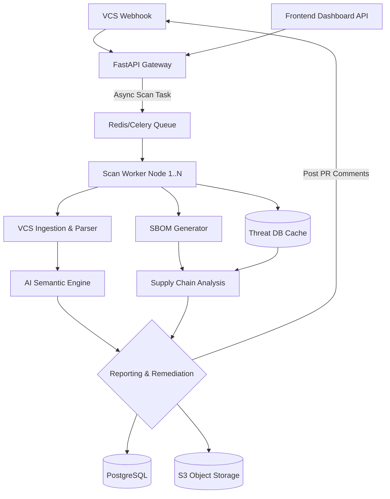

# OmniWatch AI Backend Architecture

This document outlines the technical architecture of the **OmniWatch AI Backend**, designed to provide real-time, highly-scalable security scanning, semantic AI analysis, and robust Software Bill of Materials (SBOM) generation.

## 1. System Overview

The backend acts as the core engine to process webhooks from CI/CD systems, perform static and semantic code analysis, generate SBOMs, and provide actionable remediation patches. It is built using Python (FastAPI) to natively leverage modern AI/ML frameworks like PyTorch and Transformer-based models.

### High-Level Flow
1. **Trigger**: Receive webhook from GitHub/GitLab (PR creation, push).
2. **Ingest**: Clone/Fetch the relevant code diff.
3. **Analyze**: 
   - Extract Abstract Syntax Trees (AST).
   - Evaluate dependencies.
   - Run AI-based semantic vulnerability scanning.
   - Match dependencies against OSV/NVD databases for supply chain vulnerabilities.
4. **Report & Remediate**: Generate an SBOM, create automatic AI patches, and write inline PR comments.
5. **Storage**: Save scan results, SBOM artifacts, and metrics to PostgreSQL and AWS S3.

---

## 2. Core Components

### 2.1 API & Orchestration Layer
- **Framework**: `FastAPI` (Python)
- **Responsibility**: Endpoints for webhook ingestion, frontend communication, and OAuth/PAT authentication.
- **Task Queue**: `Celery` + `Redis/RabbitMQ` for asynchronous processing of long-running security scans to avoid webhook timeouts.

### 2.2 Ingestion & Parsing Engine
- **VCS Manager**: Handles secure git pulls, creating ephemeral workspaces, and stripping sensitive items (e.g., `.env`) before analysis.
- **AST Extractors**: Language-specific parsers (tree-sitter or similar) to generate abstract syntax trees for AI consumption.

### 2.3 SBOM Generator
- **Generators**: Maps dependency trees to standard industry formats (CycloneDX, SPDX).
- **Compliance Checking**: Performs license validation and records transitive dependencies.

### 2.4 AI Semantic Analysis Engine
- **Architecture**: A decoupled client-server model. The Celery worker acts as a client using the `AsyncOpenAI` SDK to query a dedicated high-throughput inference server (`Ollama`).
- **Model**: `Qwen 2.5 Coder 7B` (via 4-bit quantization natively handled by Ollama/llama.cpp to fit within 6GB VRAM hardware limits).
- **Purpose**: Instead of basic regex matching (which leads to false positives), uses state-of-the-art open-source LLMs tailored specifically for code comprehension. This deeply understands business logic, data flow, and cryptographic hygiene.
- **Capabilities**: Detects Zero-Days, contextual logic flaws, and complex OWASP top 10 violations. Returns structured JSON containing vulnerabilities and proposed code patches.

### 2.5 Threat Intelligence & External Integrations
- **Databases**: Synchronizes with OSV (Open Source Vulnerabilities), NVD, and GitHub Advisory Database.
- **Supply Chain Analyzer**: Flags vulnerable, outdated, or malicious third-party dependencies immediately upon PR submission.

### 2.6 Auto-Remediation Engine
- **Purpose**: Generates contextually accurate security patches.
- **Actions**: Uses VCS APIs (like `PyGithub`) to create PR comments with proposed diffs.

---

## 3. Storage and Database Layer

- **Primary Relational DB**: `PostgreSQL` via `SQLAlchemy` (for users, active scans, organizational metadata, rules).
- **Vector DB / Semantic Search**: `Pinecone` or `pgvector` for storing code embeddings if RAG-based vulnerability correlation is used.
- **Artifact Storage**: `AWS S3` (or MinIO for local development) used to store generated `SBOM.json` files, detailed scan logs, and exported compliance PDFs.

---

## 4. Deployment Architecture

- **Containerization**: Fully `Docker`ized components (API, Celery Workers, Redis, DB).
- **Orchestration**: Kubernetes (K8s) or AWS ECS to auto-scale analysis workers based on queue depth (e.g., during high PR volume periods).
- **Security Context**: Dedicated unprivileged containers for the AST extraction phase to guarantee isolated environment safety.

