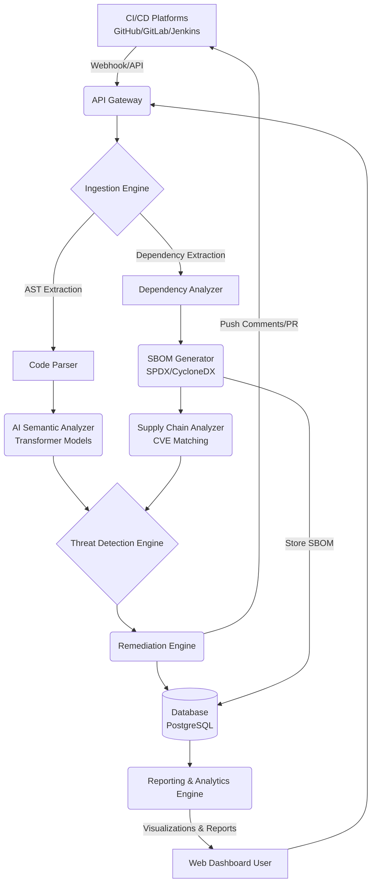

# OmniWatch AI Architecture Plan

Based on the product capabilities detailed on the landing page, here is the proposed technical architecture for the **OmniWatch AI Security Scanner**. This architecture supports real-time scanning, semantic AI analysis, seamless CI/CD integration, and robust Software Bill of Materials (SBOM) generation and management.

---

## 1. High-Level Architecture Overview

The system consists of several interacting domains:
- **Client & Integration Layer**: The main user dashboard and incoming webhooks from CI/CD platforms.
- **Ingestion & Extraction Engine**: Safely pulls repository data and extracts technical artifacts (AST, dependencies).
- **Analysis & AI Pipeline**: The core engine that evaluates code semantics and supply chain threats.
- **Remediation & Reporting**: Generates patches and detailed developer feedback.
- **Data & Storage Layer**: Securely stores scan histories, generated SBOMs, and insights.

---

## 2. Core Components

### 2.1. API Gateway & Integration Layer
- **Responsibility**: Expose secure REST/GraphQL APIs for the frontend dashboard and handle incoming webhooks from VCS providers (GitHub Actions, GitLab CI, Jenkins).
- **Features**: Rate limiting, authentication (OAuth, Personal Access Tokens), and webhook signature validation.

### 2.2. Ingestion Engine
- **Responsibility**: Securely clone or pull requisite code upon receiving a trigger (e.g., Pull Request creation).
- **Security Features**: Automatically strips sensitive files (like `.env`) and secrets from memory before analysis begins.
- **Artifact Creation**: Generates Abstract Syntax Trees (ASTs) for supported languages and extracts manifest files (`package.json`, `requirements.txt`, `go.mod`, etc.).

### 2.3. SBOM Generator (New Addition)
- **Responsibility**: Transforms the dependency graph generated during ingestion into standard SBOM formats (e.g., **CycloneDX** or **SPDX**).
- **Features**: 
  - Version tracking and transitive dependency mapping.
  - License compliance checking.
  - Export capabilities (JSON/XML) for compliance and auditing purposes.

### 2.4. AI Semantic Analyzer
- **Responsibility**: The "Deep Semantic Analysis" component mentioned on the site.
- **Features**:
  - Uses specialized Transformer models to evaluate control flow, data sanitation, and cryptographic hygiene.
  - Understands business logic context to reduce false positives significantly (upwards of 95%).
  - Identifies novel zero-day attack patterns that signature-based scanners miss.

### 2.5. Threat & Supply Chain Detection
- **Code Threats**: Correlates findings from the AI Semantic Analyzer against known vulnerability types (OWASP Top 10, CWEs).
- **Supply Chain Threats**: Analyzes the generated SBOM against real-time vulnerability databases (NVD, OSV) to flag vulnerable third-party packages.

### 2.6. Auto-Remediation & Review Engine
- **Responsibility**: Provide actionable feedback back to the developer without blocking their workflow unnecessarily.
- **Features**: 
  - Uses generative AI to propose exact, secure code patches.
  - Interacts with VCS APIs to post inline code comments directly onto the Pull Request.

### 2.7. Reporting & Analytics Dashboard
- **Responsibility**: Provide security teams and management with high-level visibility into organizational security posture, scan histories, and component inventories.
- **Features**:
  - Interactive dashboards with vulnerability trends, fix rates, and AI findings.
  - Exportable compliance reports (PDF/CSV) covering OWASP, SOC2, and custom frameworks.
  - SBOM viewer to explore, search, and filter through the entire global software supply chain structure.

---

## 3. Data Flow Example: PR Scan Pipeline

1. **Trigger**: Developer opens a Pull Request on GitHub.
2. **Ingest**: Github Webhook hits API Gateway. Ingestion engine fetches a minimal, sanitized differential tree.
3. **Parse**: Code Parser builds the AST; Dependency Analyzer builds the dependency tree.
4. **SBOM Creation**: The SBOM Generator creates a localized CycloneDX document representing the PR's software supply chain.
5. **Analyze**: 
    - The AI Semantic Analyzer reviews the AST for vulnerabilities (logic flaws, SQLi, crypto weaknesses).
    - The SBOM is checked against CVE databases to ensure newly introduced packages are safe.
6. **Remediate**: The Remediation Engine aggregates flaws, generates a patch for a detected data sanitization issue, and posts an inline comment to the GitHub PR.

---

## 4. Key Technologies
* **Frontend**: Next.js, React, Tailwind CSS (or Vanilla CSS modules as configured).
* **Backend API**: Node.js/Express or Python/FastAPI (optimal for AI workloads).
* **AI Models**: Custom-trained LLMs / Transformers deployed via PyTorch/TensorRT.
* **Database**: PostgreSQL (relational data, users, scan logs) + specialized Vector DB or Graph DB for code relation mapping.
* **Storage**: AWS S3 or equivalent for storing serialized SBOM artifacts.
